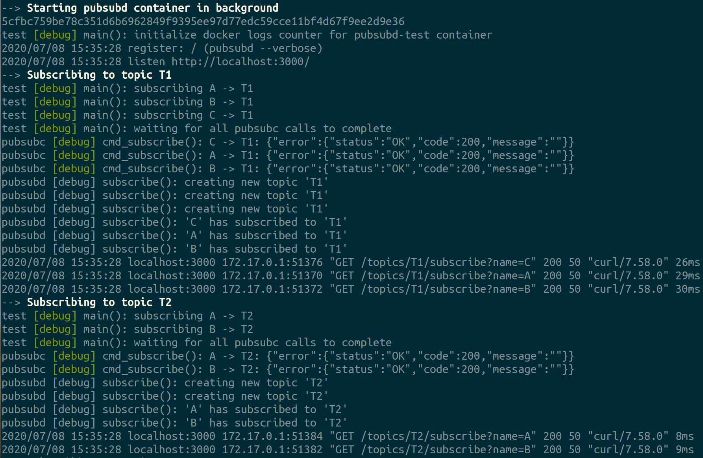

# pubsub (bash)

* [Quickstart](#quickstart)
* [Screenshots and logs](#screenshots-and-logs)
* [Why Bash?](#why-bash)
* [Design](#design)
* [Analysis](#analysis)
* [Proper design](#proper-design)
* [Testing](#testing)
* [Time spent](#time-spent)

This is a homework task to implement a basic publish-subscribe service. For the obvious reasons, the original task description cannot be provided here, but the gist is that the service should provide four methods:

* publish
* subscribe
* unsubscribe
* poll

The implementation needed to be minimal and just good enough to display general design skills and understanding of basic computer science concepts, like concurrency, synchronization, memory management and most common software development practices, such as using source control, writing documentation and testing.

The suggested programming language was Golang.

## Quick-start

Build and run test, provided `docker`, `make` and `bash` available on the system:
```bash
make test
```

For development, one can start the `pubsubd` container with:

```bash
make run-dev
```

And then execute `pubsubc` commands from another terminal window, for example:

```bash
./pubsubc subscribe info client1
{ sleep 15 ; for i in {10..1} ; do ./pubsubc publish info "countdown $i" ; done ; } &
while true ; do ./pubsubc poll info client1 ; done
```

For more information, please refer to the help section of individual utils:

```bash
make help
./pubsubd --help
./pubsubc --help
./test --help
```

## Screenshots and logs

A sample output of `make test`:



Also, there is a [full sample log](logs/test-log.txt) of `make test` included in this repository.

## Why Bash?

Even though this task was stated with the particular implementation language in mind (_Go_), it wasn't a hard requirement, and candidates, who were not so familiar with _Go_, could chose another programming language of their preference:

> I could've tried writing it in _Go_ but, it would significantly impact the time I would need to spend on the task, figuring out the subtleties of the language constructs, data structures, debugging corner cases and researching the best practices.
>
> So I turned to other programming languages I had in my "arsenal".  The first, I thought of, was _Elixir_. Architecturally, it's close to _Go_. The former uses _actor mode_ and the latter uses _CSP_ (communicating sequential processes). Also, it's relatively easy to create a service which communicates over HTTP, and do unit testing. The syntax looks rather familiar, even for people who are seeing it for the first time, so it wouldn't be a problem for the task owners to go through it when they check my solution. But there are some domain specific knowledge, needed to understand the machinery of a typical service in _Elixir_ (gen_server, supervisors, immutable containers) for people who might not be familiar with _Erlang_'s OTP concepts. So I decided that I needed some other widely understandable language.
>
> Another option for me was _C_ and _C++_. The decision was quick on those. The former is way too low level, lacking support for basic container data structures and it would be really challenging to stay within the given time constraints, for the task implementation. The latter seems to be better suited, its standard library provides all the necessary primitives I needed, but the language itself is rather verbose and the additional libraries, which I needed for HTTP and testing stuff, required writing lots of "boilerplate code", which would obscure the core algorithm of the implementation and would not allow to see the forest behind the trees. Another important argument against _C++_ was that the last time I used it, was more that ten years ago. And even though, I still retain the "muscle memory", it's not as productive as using a language which you've been working with a lot lately.
>
> I could've used _Python_, but I cannot say I have a lot of experience with it, it would be a better option for me than using _Go_, but not significantly better to make the decision in its favor. Also, _Python_'s model is single-threaded, even though there is `asyncio` which can improve it, it comes with its own problems which I didn't want to deal with.
>
> So I thought, why not go for broke and choose something completely different, given the other alternatives didn't seem to provide a full solution for me anyway. A language, that is familiar to most, at least its subset, that is rather high-level and can be used for quick prototyping, which I have enough practical experience with, and which is capable of solving the task in the time frame I had. So I started writing it in _Bash_. Also, it would be kind of neat to have a pub-sub service implemented in just a few lines of shell code, wouldn't it? At least, that was what I thought at the time :-)

## Design

The `pubsubd` service keeps all the messages it receives in OS dynamic memory (RAM). They aren't persisted between service container restarts. Each message is stored as a separate file on a _tmpfs_ file system in memory. The file name for each message is unique and is a monotonically increasing number. This allows avoiding collisions and doesn't require locking while storing new messages in a topic. Topics are represented as ordinary directories.

Each subscriber has its own "copy" of the topic, starting from the time it has subscribed to it. The messages in the topic are "delivered" to subscribers by creating hard-links to the original message file in the subscriber's directory. When linking is done, the original message file is deleted, so only "pointers" to it remain in the subscriber's directories. When the last subscriber consumes the message in the topic or un-subscribes (which effectively means removing of all unconsumed messages of the subscriber), the memory occupied by the message file gets freed because the last "pointer" to the file (hard link) has been deleted.

When subscriber subscribes to a topic, the new messages published to that topic start accumulating in the subscribers "inbox". They get consumed by the subscriber one by one, when it calls `poll` on the topic. If the topic doesn't have any messages at the time, the `poll` blocks and waits for arrival of a message using `inotifywait` utility, watching the file system events on its "inbox" dir waiting for create file event.

To make sure there are no race condition between different API calls, for example `poll` and `unsubscribe` or `subscribe` and `unsubscribe`, the `flock` utility is used as a synchronization mechanism between the methods. The lock files are created in the `/memstor`, following the directory hierarchy of topics and subscribers.

Here is an example of the `/memstor` directory content:

```
test [debug] main(): dumping internal storage of pubsubd:
/memstor
|-- subscribers
|   |-- A
|   |   |-- T1
|   |   |   |-- 1594223495:243833650
|   |   |   |-- 1594223495:250791653
|   |   |   `-- lock
|   |   |-- T2
|   |   `-- T3
|   |-- B
|   |   |-- T1
|   |   |   |-- 1594223495:243833650
|   |   |   |-- 1594223495:250791653
|   |   |   `-- lock
|   |   `-- T2
|   |-- C
|   |   `-- T1
|   |       |-- 1594223495:243833650
|   |       |-- 1594223495:250791653
|   |       `-- lock
|   `-- lock
`-- topics
    |-- T1
    |   `-- lock
    |-- T2
    `-- T3
```

## Analysis

> What is the message publish algorithm complexity in big-O notation?

In the proposed design, the message `publish` algorithm has _O(n)_ complexity, where _n_ is the number of active subscribers for the given topic. Because it needs to hard-link the original message file to _n_ destination directories.

> What is the message poll algorithm complexity in big-O notation?

The message `poll` algorithm is the weakest part of this design. It has _O(n)_ complexity, where _n_ is the number of un-consumed messages in the topic for the given subscriber. This is because, in order to find the next message to consume, the `poll` method relies on `ls` utility which lists the contents of the "inbox" and sorts the files by their names. Since files are added to the "inbox" in pre-sorted order, it takes _O(n)_ time to traverse the "inbox" directory and list the files.

With the [proper design](#proper-design), it would be _O(1)_ to find the next message to consume if there are unconsumed messages (just pop from a queue or read from a channel), and _O(n)_, if there are no unconsumed messages, where _n_ is the number of subscribers of the topic being currently blocked in the `poll` method, waiting for the new message to arrive.

> What is the memory (space) complexity in big-O notation for the algorithm?

The memory complexity is _O(n)_, where _n_ is the total number of published and unconsumed messages. Since messages are not duplicated, it doesn't directly depend on the number of subscribers. But, since there is a fixed overhead associated with the files and directories maintenance in _tmpfs_, like in any other file system, having more subscribers will consume more memory for internal book keeping of the directory entries and inodes. But, this would be similar if the implementation used standard library containers, like queues or channels, and shared pointers.

## Proper design

If I had chosen to implement this task in a proper programming language (e.g. _C++_, _Go_) I would've used a similar design. In the case of _C++_, I would probably choose `std::queue` as the container for the subscriber's topic queue, storing `std::shared_ptr` pointers to the published message in each subscriber's queue. This way, when the last shared pointer to the message gets deleted (subscriber consumed the message or un-subscribed), the memory of the message data structure gets freed. The notification of the new messages could be done using `wait` on `std::condition_variable`, and using `notify_all` on the publisher side. The API calls would be executed in the individual threads and there would be thread pool of workers to process the HTTP requests.

With _Go_, I would use channels for the subscriber's queues, which already have the needed semantics for `poll` method, blocking when there are no messages in the channel, and unblocking when the new messages published to the channel. Messages could be sent as pointers over channels, allowing to avoid memory duplication and leverage automatic memory clean up by the _Go_'s garbage collector, when no reference to a message remains. And of course, _goroutines_ is a very convenient and "natural" way of handling individual HTTP requests. This is why this task is much more suited to be implement in _Go_ than any other language.

## Testing

The included test, which can be run with `make test` command, is just a basic functional test which demonstrates that the implementation satisfies the task requirements. It's not meant to detect failures of the design or failures in the semantics of the individual API methods. For that, a dedicated test suite needs to be designed and implemented. Probably, leveraging existing frameworks like [jepsen](https://github.com/jepsen-io/jepsen).

## Time spent

| Phase               | Hours |
| :------------------ | :---: |
| research and design |   2   |
| implementation      |   4   |
| debugging           |   2   |
| testing             |   2   |
| documentation       |   3   |

